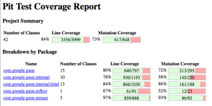
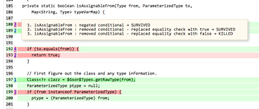

# Descartes: A Mutation Engine for PIT
[](https://travis-ci.org/STAMP-project/pitest-descartes)
[](https://coveralls.io/github/STAMP-project/pitest-descartes?branch=master)
[](https://maven-badges.herokuapp.com/maven-central/eu.stamp-project/descartes)

## Table of contents
  - [What is Descartes?](#what-is-descartes)
  - [Quick start with Maven](#quick-start-with-maven)
  - [How does Descartes work?](#how-does-descartes-work)
  - [Descartes Output](#descartes-output)
  - [Running Descartes on your project](#running-descartes-on-your-project)
  - [Releases](#releases)
  - [More...](#more)

## What is Descartes?
Descartes evaluates the capability of your test suite to detect bugs using extreme mutation testing.

Descartes is a mutation engine plugin for [PIT](http://pitest.org) which implements extreme mutation operators as proposed in the paper [Will my tests tell me if I break this code?](http://dl.acm.org/citation.cfm?doid=2896941.2896944).  
[PIT](http://pitest.org) is a mutation testing system for Java that provides a framework to extend its core functionality using plugins.
A list of PIT built-in mutation operators can be found in the [tool's web page](http://pitest.org/quickstart/mutators/).

## Quick start with Maven
This section give the basic steps to install and run Descartes on your project with Maven.
For more information and other options, see section ["Running Descartes on your project"](#running-descartes-on-your-project).

### Installing Descartes
First compile and install Descartes in the local Apache Maven repository.

In a terminal clone the repository:
```
git clone https://github.com/STAMP-project/pitest-descartes.git
```
switch to the cloned folder:
```
cd  pitest-descartes
```
and install Descartes using the regular [Apache Maven](https://maven.apache.org) commands:
```
mvn install
```
After installing the package, PIT should be able to find the Descartes mutation engine.


### Usage
Descartes is a plugin for PIT so they have to be used together.
PIT integrates with majors test and build tools such as [Maven](https://maven.apache.org),
[Ant](http://apache.ant.org) and [Gradle](https://gradle.org).


### Maven
Then, configure PIT for the project and specify `descartes` as the engine inside a `mutationEngine` tag in the `pom.xml` file.

``` xml
<plugin>
  <groupId>org.pitest</groupId>
  <artifactId>pitest-maven</artifactId>
  <version>1.2.0</version>
  <configuration>
    <mutationEngine>descartes</mutationEngine>
    <mutators>
      <mutator>void</mutator>
      <mutator>null</mutator>
      <mutator>true</mutator>
      <mutator>false</mutator>
      <mutator>empty</mutator>
      <mutator>0</mutator>
      <mutator>1</mutator>
      <mutator>(byte)0</mutator>
      <mutator>(byte)1</mutator>
      <mutator>(short)1</mutator>
      <mutator>(short)2</mutator>
      <mutator>0L</mutator>
      <mutator>1L</mutator>
      <mutator>0.0</mutator>
      <mutator>1.0</mutator>
      <mutator>0.0f</mutator>
      <mutator>1.0f</mutator>
      <mutator>'\40'</mutator>
      <mutator>'A'</mutator>
      <mutator>""</mutator>
      <mutator>"A"</mutator>
    </mutators>
  </configuration>
  <dependencies>
    <dependency>
      <groupId>eu.stamp-project</groupId>
      <artifactId>descartes</artifactId>
      <version>1.1</version>
    </dependency>
  </dependencies>
</plugin>
```
With PIT and Descartes configured, just run the regular mutation coverage goal in the folder of the project under test:

```
cd my-project-under-test
mvn clean package # ensures clean state
mvn org.pitest:pitest-maven:mutationCoverage -DmutationEngine=descartes
```


## How does Descartes work?
### Mutation testing
Mutation testing allows you to verify if your test suites can detect possible bugs.
Mutation testing does it by introducing small changes or faults into the original program. These modified versions are called **mutants**.
A good test suite should able to *kill* or detect a mutant. [Read more](https://en.wikipedia.org/wiki/Mutation_testing).
Traditional mutation testing works at the instruction level, e.g., replacing ">" by "<=", so the number of generated mutants is huge,
as the time required to check the entire test suite.
That's why the authors of [Will my tests tell me if I break this code?](http://dl.acm.org/citation.cfm?doid=2896941.2896944) proposed
an *Extreme Mutation* strategy, which works at the method level.

### Extreme Mutation Testing
In Extreme Mutation testing, the whole logic of a method under test is eliminated.
All statements in a `void` method are removed. In other case the body is replaced by a return statement. With this approach,
a smaller number of mutants is generated. Code from the authors can be found in [their GitHub repository](https://github.com/cqse/test-analyzer).

The goal of Descartes is to bring an effective implementation of this kind of mutation operator into the world of PIT and
check its performance in real world projects.

### Mutation operators
The goal of *extreme mutation operators* is to replace the body of a method by one simple return instruction
or just remove all instructions if is possible. The tool supports the following mutation operators:
#### `void` mutation operator
This operator accepts a `void` method and removes all the instructions on its body. For example, with the following class as input:

``` java
class A {

  int field = 3;

  public void Method(int inc) {
    field += 3;
  }

}
```
the mutation operator will generate:

``` java
class A {

  int field = 3;

  public void Method(int inc) { }

}
```

#### `null` mutation operator
This operator accepts a method with a reference return type and replaces all instructions
with `return null`. For example, using the following class as input:
``` java
class A {
    public A clone() {
        return new A();
    }
}
```
this operator will generate:

``` java
class A {
    public A clone() {
        return null;
    }
}
```
#### `empty` mutation operator

This is a special operator which targets methods that return arrays. It replaces the entire
body with a `return` statement that produces an empty array of the corresponding type.
For example, the following class:

``` java
class A {
  public int[] getRange(int count) {
    int[] result = new int[count];
    for(int i=0; i < count; i++) {
      result[i] = i;
    }
    return result;
  }
}
```
will become:

``` java
class A {
  public int[] getRange(int count) {
    return new int[];
  }
}
```

#### Constant mutation operator
This operator accepts any method with primitive or `String` return type. It replaces the method body
with a single instruction returning a defined constant.
For example, if the integer constant `3` is specified, then for the following class:

``` java
class A {
    int field;

    public int getAbsField() {
        if(field >= 0)
            return field;
        return -field;
    }
```
this operator will generate:

``` java
class A {
    int field;

    public int getAbsField() {
        return 3;
    }
}
```

## Descartes Output

PIT reporting extensions work with Descartes and include:
  - a summary report with line coverage and mutation coverage scores  
     
  - a detailed report on line coverage and mutation coverage for each source file  
     
    Light green shows line coverage, dark green shows mutation coverage.  
    Light pink show lack of line coverage, dark pink shows lack of mutation coverage.
Descartes also provides two new reporting extensions:
  - a general reporting extension supporting JSON files. It works also with **Gregor**, the default mutation engine for PIT. To use just set `JSON` as report format for PIT.
  - a reporting extension desgined for Descartes that generates a JSON file with information about pseudo and partially tested methods. To use just set `METHOD` as report format for PIT.

## Running Descartes on your project
### Installing Descartes
First compile and install Descartes in the local Apache Maven repository.

In a terminal clone the repository:
```
git clone https://github.com/STAMP-project/pitest-descartes.git
```
switch to the cloned folder:
```
cd  pitest-descartes
```
and install Descartes using the regular [Apache Maven](https://maven.apache.org) commands:
```
mvn install
```
After installing the package, PIT should be able to find the Descartes mutation engine.


### Usage
Descartes is a plugin for PIT so they have to be used together.
PIT integrates with majors test and build tools such as [Maven](https://maven.apache.org),
[Ant](http://apache.ant.org) and [Gradle](https://gradle.org).


### Maven
Then, configure PIT for the project and specify `descartes` as the engine inside a `mutationEngine` tag in the `pom.xml` file.

``` xml
<plugin>
  <groupId>org.pitest</groupId>
  <artifactId>pitest-maven</artifactId>
  <version>1.2.0</version>
  <configuration>
    <mutationEngine>descartes</mutationEngine>
    <mutators>
      <mutator>void</mutator>
      <mutator>null</mutator>
      <mutator>true</mutator>
      <mutator>false</mutator>
      <mutator>empty</mutator>
      <mutator>0</mutator>
      <mutator>1</mutator>
      <mutator>(byte)0</mutator>
      <mutator>(byte)1</mutator>
      <mutator>(short)1</mutator>
      <mutator>(short)2</mutator>
      <mutator>0L</mutator>
      <mutator>1L</mutator>
      <mutator>0.0</mutator>
      <mutator>1.0</mutator>
      <mutator>0.0f</mutator>
      <mutator>1.0f</mutator>
      <mutator>'\40'</mutator>
      <mutator>'A'</mutator>
      <mutator>""</mutator>
      <mutator>"A"</mutator>
    </mutators>
  </configuration>
  <dependencies>
    <dependency>
      <groupId>eu.stamp-project</groupId>
      <artifactId>descartes</artifactId>
      <version>1.1</version>
    </dependency>
  </dependencies>
</plugin>
```
With PIT and Descartes configured, just run the regular mutation coverage goal in the folder of the project under test:

```
cd my-project-under-test
mvn clean package # ensures clean state
mvn org.pitest:pitest-maven:mutationCoverage -DmutationEngine=descartes
```
### Specifying operators

The operators to be used must be specified in the `pom.xml`. Each operator identifier should be added
to the `mutators` element inside the `configuration` element. `void` and `null` operators are
identified by `void` and `null` respectively.
For the constant mutation operator, the values can be specified using the regular literal notation
used in a Java program. For example `true`, `1`, `2L`, `3.0f`, `4.0`, `'a'`, `"literal"`,
represent `boolean`, `int`, `long`, `float`, `double`, `char`, `string` constants.
Negative values and binary, octal and hexadecimal bases for integer constants are also supported
as stated by the [language specification](https://docs.oracle.com/javase/specs/jls/se7/html/jls-3.html#jls-3.10).
In order to specify a `byte` or `short` value, a cast-like notation can be used: `(short) -1`, `(byte)0x1A`.

The following configuration:
``` xml
<mutators>
    <mutator>void</mutator>
    <mutator>4</mutator>
    <mutator>"some string"</mutator>
    <mutator>false</mutator>
</mutators>
```
will instruct the tool to use the `void` operator and the constant operator will replace the body of
every `int` returning method with `return 4;` and will use `"some string"` and `false` for every `string` and `boolean` method.
If no operator is specified, the tool will use `void` and `null` by default. Which is equivalent to:
``` xml
<mutators>
    <mutator>void</mutator>
    <mutator>null</mutator>
</mutators>
```
The rest of the goals defined by the `pitest-maven` plugin should run in the same way without any
issues, see <http://pitest.org/quickstart/maven/>.

### Gradle
Follow the [instructions](http://gradle-pitest-plugin.solidsoft.info/) to set up PIT
for a project that uses [Gradle](https://gradle.org/).
In the `build.gradle` file add the local Maven repository to the `buildscript` block and set
a `pitest` configuration element inside the same block. In the `dependencies` block put the artifact information:
```
pitest 'eu.stamp-project:descartes:1.1'
```
then specify `descartes` in the `mutationEngine` option inside the plugin configuration.
An example of the final configuration could be:
```
buildscript {
  repositories {
    mavenCentral()
    mavenLocal()
  }

  configurations.maybeCreate("pitest")

  dependencies {
    classpath 'info.solidsoft.gradle.pitest:gradle-pitest-plugin:1.1.9'
    pitest 'eu.stamp-project:descartes:1.1'
  }
}

apply plugin: "info.solidsoft.pitest"

pitest {
  mutationEngine = "descartes"
}
```
At last, run the `pitest` task for the project under test.
```
gradle pitest
```
### Running from the command line
Descartes can be used when invoking PIT from the command line. To do this, 
follow [the instructions](http://pitest.org/quickstart/commandline/) for running PIT,
include Descartes in the classpath specification and add `--mutationEngine=descartes`.

### Maven repository
Compiled modules are available from [a custom Maven repository](https://stamp-project.github.io/stamp-maven-repository/).
Detailed instructions can be found [here](https://github.com/STAMP-project/stamp-maven-repository).

## Releases
* [Stable release candidate 0.2](https://github.com/STAMP-project/pitest-descartes/releases/tag/0.2-D1.2)

## More...
### External Links

Articles mentioning Descartes:

* [Mutation testing with PIT and Descartes](http://massol.myxwiki.org/xwiki/bin/view/Blog/MutationTestingDescartes)
* [Controlling Test Quality](http://massol.myxwiki.org/xwiki/bin/view/Blog/ControllingTestQuality)

### License
Descartes is published under LGPL-3.0 (see [LICENSE.md](LICENSE.md) for further details).

### Funding

Descartes is partially funded by research project STAMP (European Commission - H2020)

